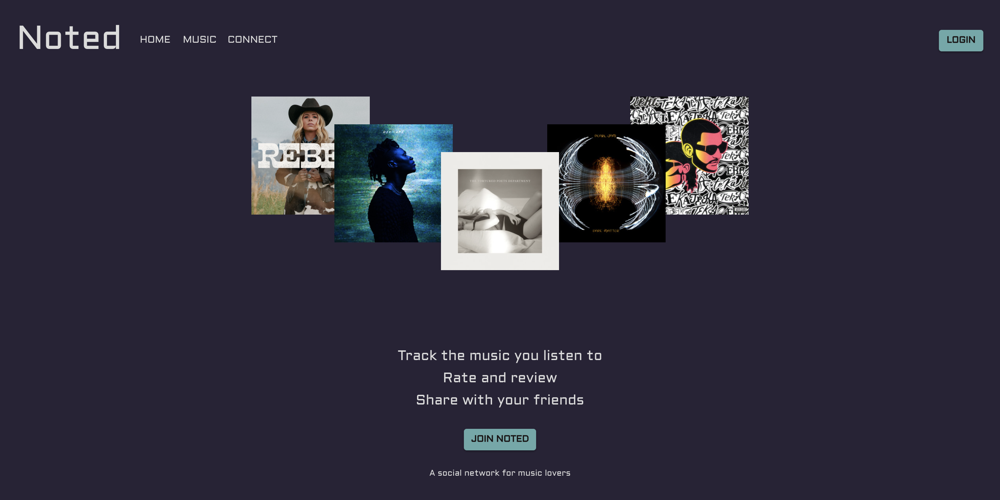
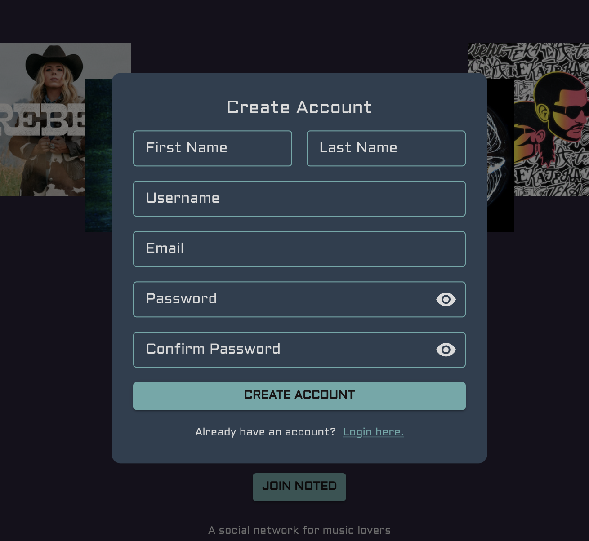
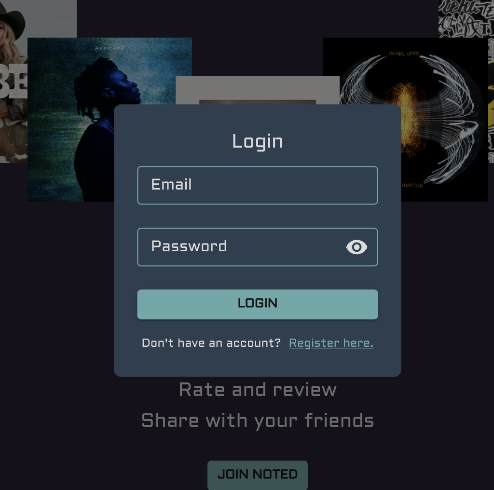
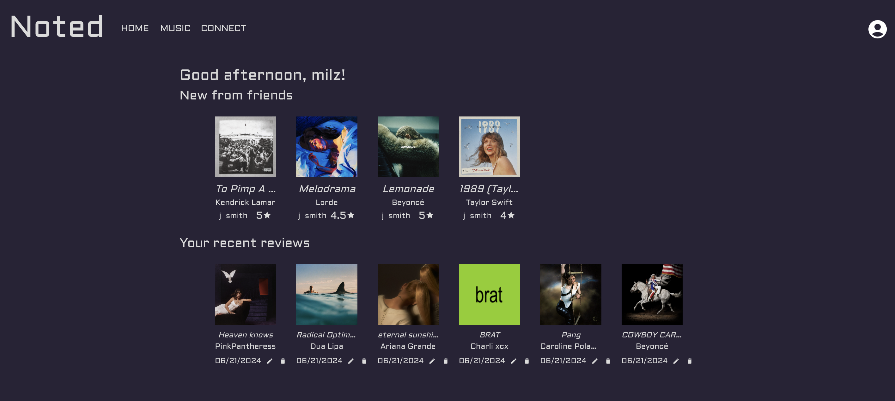
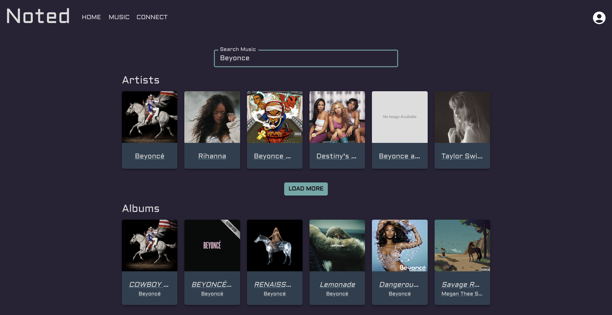
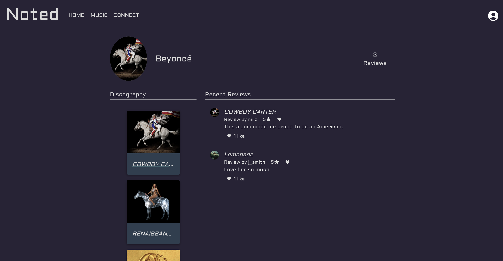
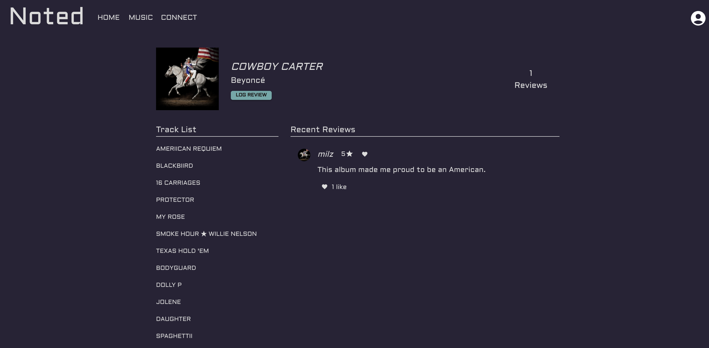
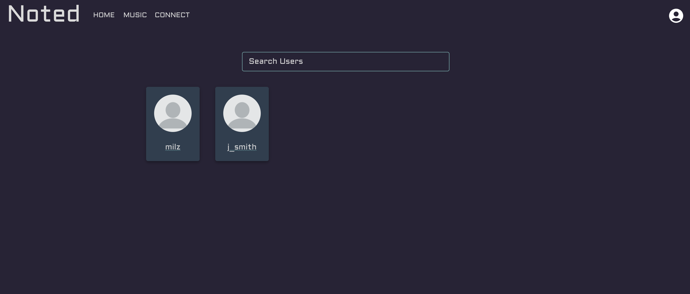
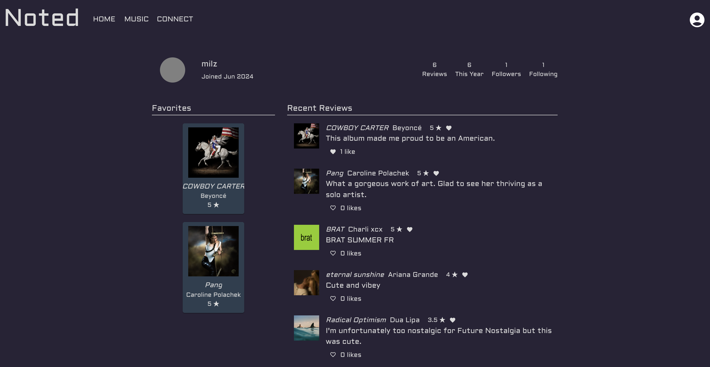

# Noted
A social media web application for music enthusiasts to track, review, and share the music they listen to. 

## Table of Contents
* [Overview](#overview)
* [Screenshots](#screenshots)
* [Deployment](#deployment)
* [Docs](#docs)
* [Features](#features)
* [Feedback](#feedback)
* [Contact](#contact)

## Overview
Note-d is a social media web application for music enthusiasts to review and share music they listen to with other users. Registered users can search the Spotify database for artists and albums, view profiles that feature artist and album data as well as relevant reviews by other users. Users can also search for other users, view their profile and follow them. 

**Current Features**
- Register for an account
- Login & logout of an account
- Search the Spotify library by album, artist, and track
- Create, edit, and delete reviews of albums
- View an album and artist's profile that has stats and recent reviews
- View recent reviews on dashboard
- Search and follow users
- Like and unlike reviews

**Features Coming Soon**
- Comment reviews

**Technologies**
This project was built using the MERN stack (MongoDB, Express.js, React.js, Node.js). To simplify the development process, the frontend and backend are split up into separate repositories. Below is full list of additional technologies & tools used for this project along with links to each repository:

**[Frontend Repo](https://github.com/emilio-fv/noted-frontend)**
- React, Redux, Material UI, React Router DOM, Redux-Persist

**[Backend Repo](https://github.com/emilio-fv/noted-backend)** 
- node, express, mongoose, JWT, bcrypt, axios, helmet, CORS, cookie-parser

**Development Tools** 
- npm, nodemon, webpack, winston, babel, eslint, Docker, Postman, Responsively, Figma, Trello

## Screenshots
**Landing Page**

**Register**

**Login**

**Dashboard**

**Music Search**

**Artist Profile**

**Album Profile**

**User Search**

**User Profile**

## Deployment
There are still a few kinks here and there but the deployed application can be found at: https://noted-frontend.vercel.app/

## Docs
Documentation for this project can be found [here](https://garnet-bathtub-08d.notion.site/Noted-8cf96665dc4e4a37b723c8134b095965).

## Feedback
If you have a moment, please fill out this [feedback form](https://forms.gle/kDwecbB38me6jtVn6)!

## Contact
Created by [@emilio-fv](https://github.com/emilio-fv) - feel free to contact me via [email](mailto:emiliofv.sd@gmail.com)!